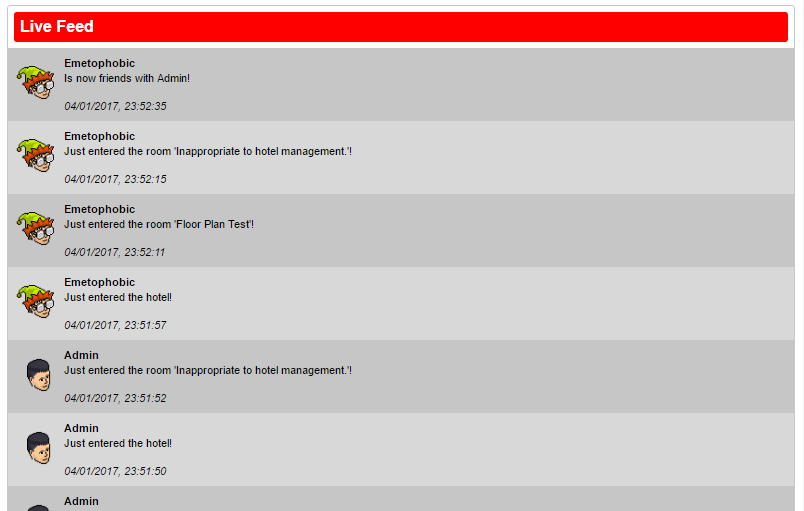

# arcturus-friend-feed-plugin

- Explain here what the plugin is all about.



## Compile

- Simple maven command on how to compile it.

## Configuration

- Introduction.

### Pusher


### Arcturus

When you placed the compiled version of this plugin in the `plugins` folder of [Arcturus](https://bitbucket.org/Wesley12312/arcturus). Some plugin configuration is needed in order to get it working. Below is shown the configuration keys without values, the key names speak for themself, and need to be placed in the config.ini file of [Arcturus](https://bitbucket.org/Wesley12312/arcturus). The needed information can be obtained [pusher.com](https://pusher.com).

```
#ArcturusFriendFeedPlugin
plugin.friendfeed.pusher.id=
plugin.friendfeed.pusher.key=
plugin.friendfeed.pusher.secret=
plugin.friendfeed.pusher.cluster=
plugin.friendfeed.pusher.encrypted=true
```

### Webapi

Setting up the webapi is quite simple. Include the friendfeed.js file in your document and you're ready to use the api.
A simple and basic usage of the api is shown below:

```
<script>
    var liveFeed = new FriendFeed({
        userId: 1,
        limit: 20,
        container: document.getElementById("live-feed"),
        pusherKey: "PUSHER_KEY_HERE",
        pusherOptions: {
            cluster: "eu",
            encrypted: true,
            authEndpoint: "/example/auth.php",
        }
    });
</script>
```

As you can see the FriendFeed constructor consumes some parameters in order to make it work. A list of those parameters with description is noted below:

Property | Description
--- | ---
userId | The id of the user which we want to show the live feed for.
limit | The amount of messages shown.
container | Where the messages are being shown. Keep in mind that this is valid DOM object.
pusherKey | The key used to indentify your pusher api. Can be obtained from [pusher.com](https://pusher.com).
pusherOptions | Options used to setup the pusher api itself. More about this can be found [here](https://github.com/pusher/pusher-js).
templateLookUrl | A url pointing to the base path which is used to obtain a look image. Default value is: `http://habbo.com/habbo-imaging/avatarimage`.
templateAchievementUrl | A url pointing to the base path which is used to obtain the achievement image. Default value is: `https://habboo-a.akamaihd.net/c_images/album1584/`.

#### Authentication endpoint

Because this api uses the [private channels](https://pusher.com/docs/client_api_guide/client_private_channels) feature of [pusher.com](https://pusher.com), it is needed to authenticate the user for the channel. An example on how to do this can be found [here](webapi/example/auth.php).

The core of the file is as follow:

```
if ('private-user-' . $userId != $channelName) {
    header('HTTP/1.0 401 Unauthorized');
    echo 'Forbidden';
    exit;
}

$pusher = new Pusher(PUSHER_KEY, PUSHER_SECRET, PUSHER_ID, [
    'cluster' => 'eu',
    'encrypted' => true
]);

echo $pusher->socket_auth($channelName, $socketId);
```

The channel user can be protected againsted other users, but this is optional. The choice is up to you! The part below it is to tell [pusher.com](https://pusher.com) to grand the socket access to the following channel.